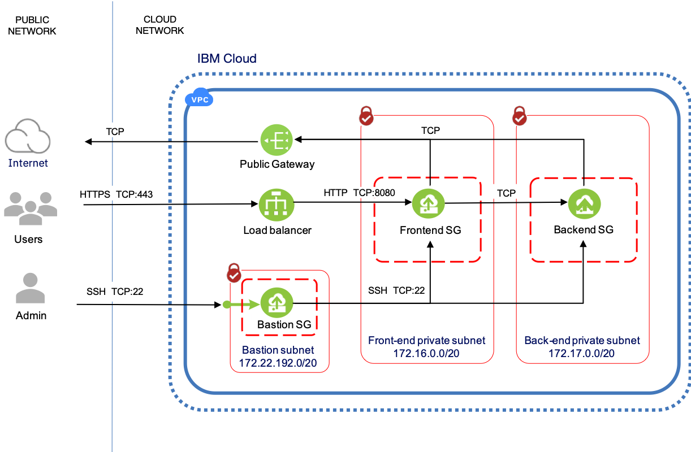

# Example for VPC access with a Bastion Host from Schematics


This Terraform example for IBM Cloud Schematics illustrates how to
deploy an IBM Cloud Gen2 VPC with a bastion host to provide secure
remote SSH access. The intended usage is for remote software
installation using Terraform remote-exec or Redhat Ansible executed by
Schematics.

The example and Terraform modules are supplied 'as is' and only seek to
implement a 'reasonable' set of best practices for bastion host
configuration. Your own organisation may have additional requirements
that may need be implemented before it can be used.

## Multi-tier VPC with bastion host SSH access


The figure here illustrates the configuration of the VPC deployed by
this example. For a detailed explanation of bastion host, ACL and
security group configuration, please see the IBM Developer article
[Secure VPC access with a bastion host and Terraform]().



This example was written for use with IBM Cloud Schematics, therefore
the provider block does not include an API Key. To run standalone with
Terraform, modify the example to input your IBM Cloud API key as an
input variable.


To mitigate the security risks of SSH connections over the public network to the 
bastion hosts and VSIs when using this example with Schematics, access is only permitted
from the Schematics service CIDRs. When deployed using Schematics, network 
Access Control List (ACL) rules and security groups are configured to only 
allow SSH access from the CIDR ranges used by the Schematics service. Access 
from all other public addresses is denied. If SSH access is desired from a public CIDR, an input value for
`ssh_source_cidr_override` should be specified at execution time.

If used with standalone Terraform, `ssh_source_cidr_override` is
set by default to open access with the CIDR "0.0.0.0/0". To limit access
to a specific source IP address or CIDR, configure a restrictive CIDR.

The following resources are deployed by this template and may incur
charges.

- 1 x Floating IP address
- 2 x Public Gateway
- 1 x Load Balancer
- 4 x VSIs
- 1 x VPC
- Access Control Lists
- Security Groups

## Requirements


|  **Name**                  | **Version** |
|  --------------------------| -------------|
|  terraform                 | ~> 0.12 |
|  terraform_provider_ibm    | ~> 1.5.2 |


## Inputs

| name | description | type | required | default | sensitive |
| ---------- | -------- | -------------- | ---------- | ----------- | ----------- |
| ibm_region | Region of deployed VPC | string | |"us-south" |   | 
|  vpc_name  | Unique VPC name     | string | | "ssh-bastion-host"   | 
|  resource_group_name | Name of IBM Cloud Resource Group used for all VPC resources | string | | "Default" |  | 
|  ssh_source_cidr_override |  User specified list of CIDR ranges requiring SSH access. When used with Schematics the default is to allow access only from Schematics, otherwise set to "0.0.0.0/0" | list(string) | | {{Schematics}}  |   | 
|  bastion_cidr | CIDR range for bastion subnets  |  string  | | "172.22.192.0/20"  |   | 
|  frontend_cidr |  List of CIDRs the bastion is to route SSH traffic to |  list(string) | | "172.16.0.0/20"  |   | 
|  backend_cidr" |  List of CIDRs the bastion is to route SSH traffic to   | list(string) | | "172.17.0.0/20"  |   | 
|  vsi_profile | Profile for VSIs deployed in frontend and backend  | string  | | "cx2-2x4" |  | 
|  image_name |  OS image for VSI deployments. Only tested with Centos | string | | "ibm-centos-7-6-minimal-amd64-1" |  | 
|  ssh_key_name | Name given to public SSH key uploaded to IBM Cloud for VSI access |  string |  ✓   |    |      
|  ssh_accesscheck | Set to "true' if access to VSIs via SSH is to be validated |  string | | "false" |  | 
|  ssh_private_key | Optional private key from key pair. Only required if it desired to validate remote SSH access to the bastion host and VSIs. | string  | | |  ✓   |               

## Outputs

|  **name**      |    **description**  |
|  --------------------------------------- | ------------------------------------------- |
|  bastion_ip_addresses             |     Public bastion IP address
|  frontend_server_host_ip_addresses |  List of frontend VSI private IP addresses |
|  backend_server_host_ip_addresses  |  List of backend VSI private IP addresses |

## Instructions

1.  Make sure that you have the [required IBM Cloud IAM
    permissions](https://cloud.ibm.com/docs/vpc?topic=vpc-managing-user-permissions-for-vpc-resources) to
    create and work with VPC infrastructure and you are [assigned the
    correct
    permissions](https://cloud.ibm.com/docs/schematics?topic=schematics-access) to
    create the workspace and deploy resources.
2.  [Generate an SSH
    key](https://cloud.ibm.com/docs/vpc?topic=vpc-ssh-keys).
    The SSH key is required to access the provisioned VPC virtual server
    instances via the bastion host. After you have created your SSH key,
    make sure to [upload this SSH key to your IBM Cloud
    account](https://cloud.ibm.com/docs/vpc-on-classic-vsi?topic=vpc-on-classic-vsi-managing-ssh-keys#managing-ssh-keys-with-ibm-cloud-console) in
    the VPC region and resource group where you want to deploy this
    example
3.  Create the Schematics workspace:
   1.  From the IBM Cloud menu
    select [Schematics](https://cloud.ibm.com/schematics/overview).
       - Click Create a workspace.   
       - Enter a name for your workspace.   
       - Click Create to create your workspace.
    2.  On the workspace **Settings** page, enter the URL of this example in
    the Schematics examples Github repository.
     - Select the Terraform version: Terraform 0.12.
     - Click **Save template information**.
     - In the **Input variables** section, review the default input
        variables and provide alternatives if desired. The only
        mandatory parameter is the name given to the SSH key that you
        uploaded to your IBM Cloud account.
      - Click **Save changes**.

4.  From the workspace **Settings** page, click **Generate plan** 
5.  Click **View log** to review the log files of your Terraform
    execution plan.
6.  Apply your Terraform template by clicking **Apply plan**.
7.  Review the log file to ensure that no errors occurred during the
    provisioning, modification, or deletion process.

The output of the Schematics Apply Plan will list the public IP address
of the bastion host and the frontend and backend app servers. These can
be used for input to subsequent software provisioning templates using
remote-exec or Redhat Ansible.

```
Outputs:

frontend_server_host_ip_addresses = [
  [
    "172.16.0.5",
    "172.16.2.5",
  ],
]

backend_server_host_ip_addresses = [
  [
    "172.17.0.4",
  ],
]

bastion_host_ip_address = [
  "52.116.132.26",
]

app_dns_hostname = 2989c099-us-south.lb.appdomain.cloud
```

## Validating the VPC security configuration

The default VPC security configuration is to only allow SSH access from
IP ranges used by IBM Cloud Schematics. Any access from IP addresses
outside these ranges will be denied.

To validate Schematics has successfully provisioned SSH access, the template can be run with the
input variable `ssh_accesscheck = true`. This uses Terraform
remote-exec to SSH onto the deployed VSIs and return the host name. If Schematics cannot 
access the VSIs the Apply will fail with a `timeout` message.  


To validate that access is denied from other IP addresses, the following
SSH command can be used from a local workstation. Copy and paste the
command into a terminal session, inserting the returned values for the
bastion IP and one of the frontend VSIs and the path to the file
containing the private SSH key.

```
ssh -i ~/.ssh/<ansible> -o ProxyCommand="ssh -i ~/.ssh/<ansible>
-W %h:%p root@52.116.132.26" root@172.16.0.5
```

The command will return:

```
ssh: connect to host 52.116.132.26 port 22: Operation timed out
```
